<p align="center">
  
</p>

<h1 align="center">Calabosos y Babosos</h1>

<p align="center">
  <em>The slimy terminal platform for text adventures with images that the world didn't know it needed.</em>
</p>

<p align="center">
  
  
  
  
</p>

<p align="center">
  <b>English</b> | <a href="README_ES.md">Español</a>
</p>

---

<p align="center">
  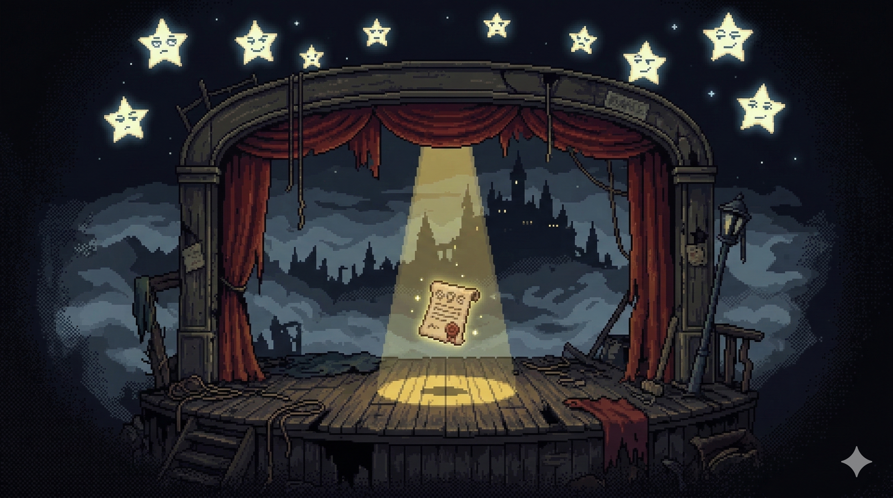
</p>

Welcome to the Slimy Engine! A React + Vite interactive terminal platform, designed to load and run text adventures with images. With more ego than logic, the system is optimized for creating and enjoying grotesque, glorious, and absolutely playable narrative adventures right from the browser.

If you're here, you've already made a questionable life decision. Congratulations.

---

## What Even Is This?

**Calabosos y Babosos** (Dungeons & Slugs) is a browser-based interactive fiction engine disguised as a retro terminal. Because plain text adventures are for people with no ambition, this one comes with:

- **Branching narrative** with multiple paths and player choices (the illusion of free will, how exciting)
- **D20 dice system** with stat modifiers and skill checks (because your fate should depend on math you don't understand)
- **Turn-based combat**, shops, crafting, puzzles, and 18 step types (yes, eighteen. We have commitment issues with simplicity)
- **RPG systems**: levels, XP, skill trees, traits, relationships (your character will have more personal growth than you ever will)
- **A sarcastic narrator** who breaks the fourth wall and judges every decision you make
- **Visual story editor** powered by ReactFlow (for people who think they can make better games than us. Spoiler: they can't)
- **Pixel-art aesthetic** with gorgeous hand-crafted scenes (the only beautiful thing in this project)

The goal? Defeat the **Slug King** in the *Abyss of Slugs* within the kingdom of **Viscaria**. You play as **BOB**. Good luck. You'll need it. The Narrator certainly won't help you.

<p align="center">
  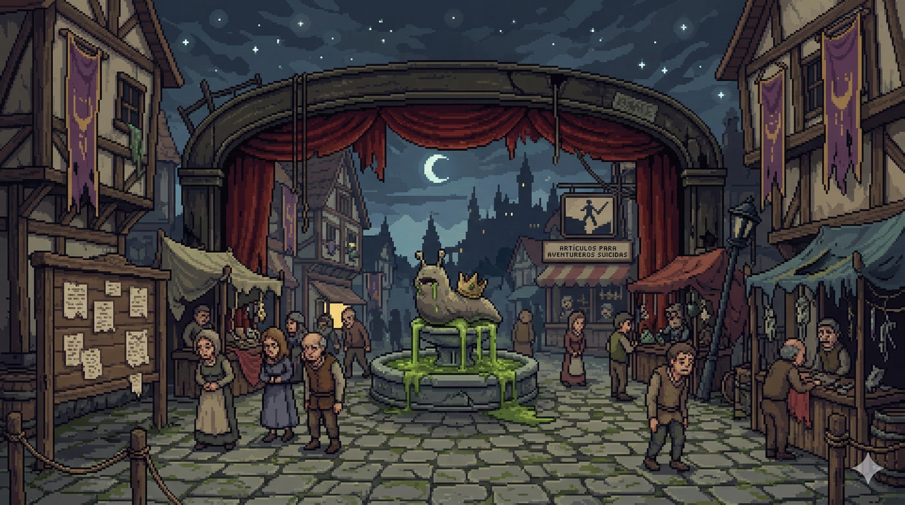
</p>

---

## Screenshots

<p align="center">
  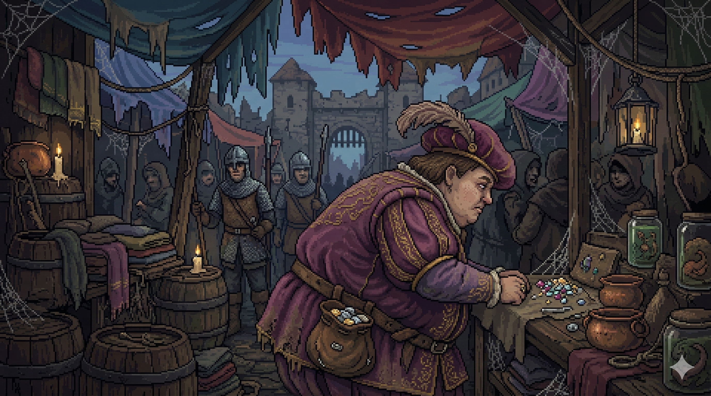
  &nbsp;
  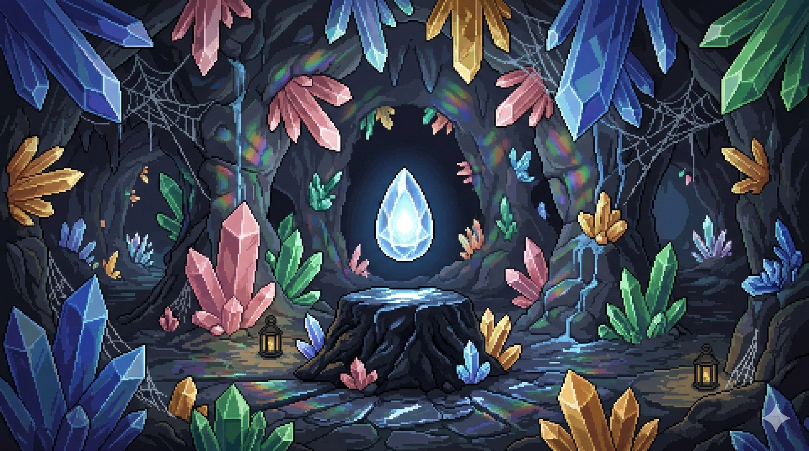
</p>

<p align="center">
  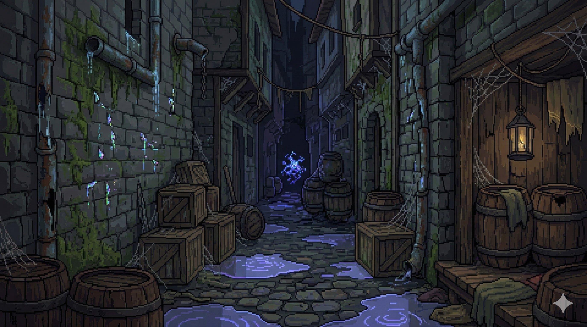
  &nbsp;
  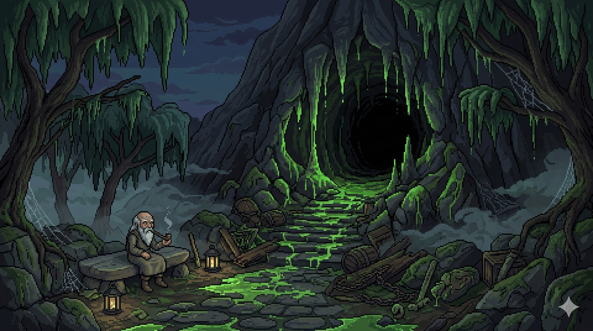
</p>

<p align="center">
  <sub>All scenes rendered in beautiful pixel art. The only thing here that won't disappoint you.</sub>
</p>

---

## Meet the Cast (You'll Wish You Hadn't)

<p align="center">
  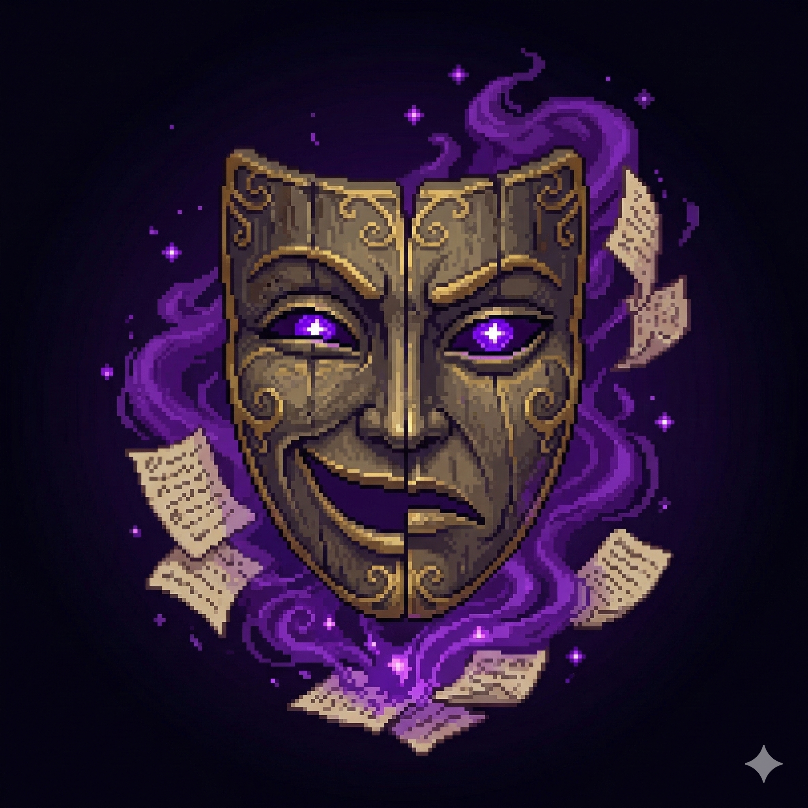
  &nbsp;&nbsp;
  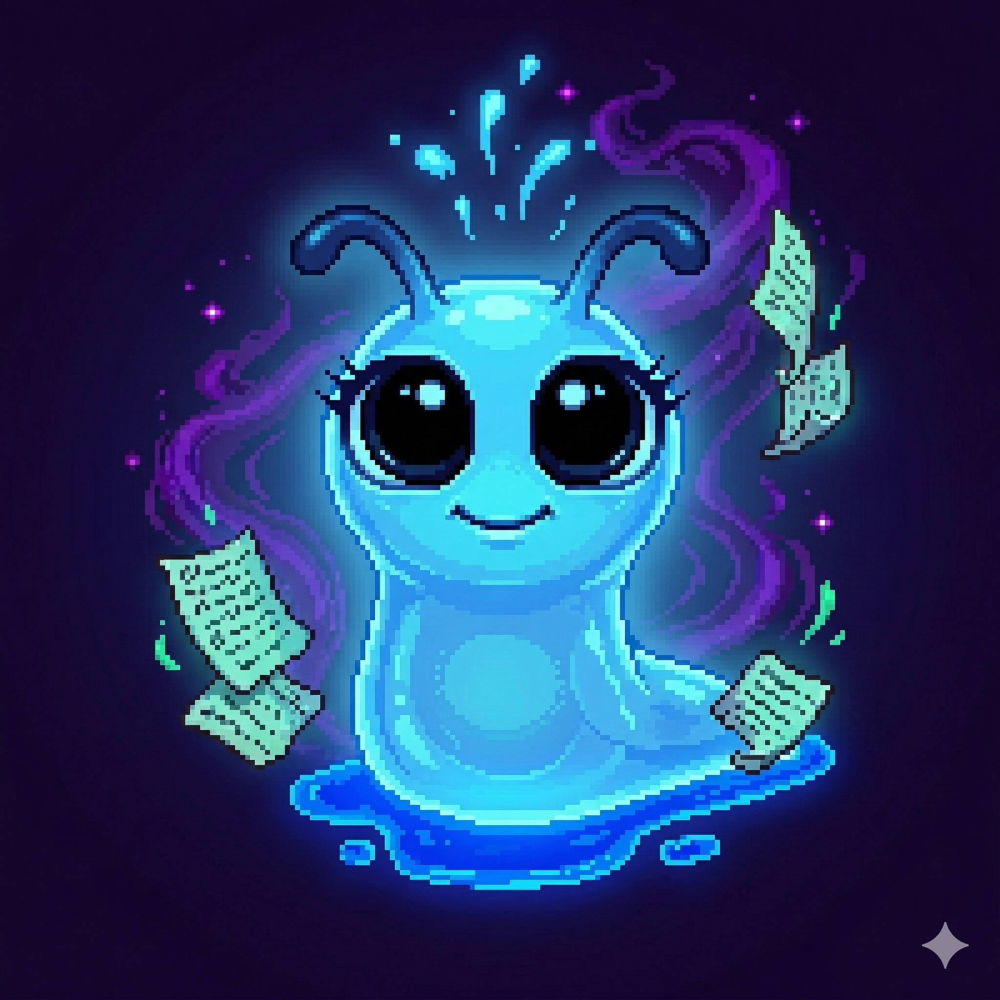
  &nbsp;&nbsp;
  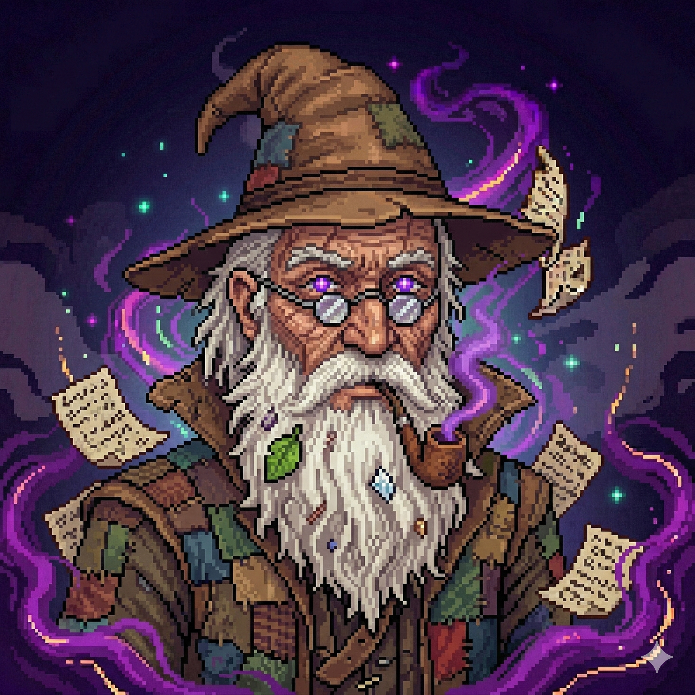
</p>

<p align="center">
  <b>The Narrator</b> (hates you) &bull; <b>Nerly the Slug</b> (tolerates you) &bull; <b>The Elder</b> (pities you)
</p>

> Yes, you can argue with the Narrator. And yes, he is always smarter and more handsome than you.

---

## Slimy Installation

```bash
# Crawl into the directory like the slug you are
cd motor_web

# Install dependencies because we never have enough node_modules
npm install

# Launch the suffering
npm run dev
```

Open `http://localhost:5173` and prepare for a viscous experience. If you don't know how to use a terminal, this game will hate you as much as we do.

---

## Tech Stack (The Glue Holding This Mess Together)

| Technology | Purpose |
|---|---|
| **React 19** + **TypeScript 5.9** | UI & type safety (pretending we're professionals) |
| **Vite 6.2** | Bundler & dev server (because reinventing the wheel is for unimaginative people) |
| **Zustand 5.0** | Global state (a.k.a. detailed registry of your failures) |
| **@xyflow/react 12.10** | Visual story editor (for people who think dragging boxes is "game design") |
| **styled-components 6.1** | CSS-in-JS (because even slugs deserve to look pretty) |
| **localforage** | Local persistence via IndexedDB (your bad decisions will follow you forever) |
| **jszip + file-saver** | Export/import (your hopes and dreams, packaged in a ZIP) |

---

## Architecture (The "Brain", If Slugs Had Brains)

```
React UI (components, widgets, terminal)
    ↕ useGameLoop (consumes StepResults, sends PlayerActions)
    ↕ Zustand Store (useAppStore)
    ↕
GameEngine (pure TypeScript, async generators)
    ├── ConditionEvaluator    (judges your every move)
    ├── EffectsApplier        (applies consequences you deserve)
    ├── DiceRoller            (decides your fate with cold mathematics)
    └── AudioManager          (soundtrack for your suffering)
```

The `GameEngine` is **pure TypeScript** with zero React dependencies. It uses `async *enterScene()` as a generator that yields `StepResult` objects for the UI to render. The UI responds with `sendAction(PlayerAction)` when player input is needed.

In other words: the engine does the thinking because you clearly can't.

---

## 18 Narrative Step Types (Because 17 Wasn't Enough)

| Type | Description | Player Input |
|---|---|---|
| `dialog` | Character dialogue (prepare for insults) | No (Enter) |
| `choice` | Player options (the illusion of control) | Yes |
| `dice` | D20 roll with modifiers (your destiny in a number) | Yes |
| `input` | Free text input (yes, we'll judge your spelling) | Yes |
| `effects` | Apply effects silently (surprise consequences!) | No |
| `branch` | Auto-branch by conditions (the engine decides for you) | No |
| `random` | Weighted random outcome (like life, but more fair) | No |
| `check` | Deterministic stat check (spoiler: you'll fail) | No |
| `shop` | Buy/sell interface (capitalism, even in fantasy) | Yes |
| `combat` | Turn-based combat (violence is always an option) | Yes |
| `notify` | Visual notification (bad news, usually) | No |
| `wait` | Dramatic pause (killing your hopes slowly) | No |
| `sound` | Sound effect (a soundtrack for your misery) | No |
| `craft` | Combine items (play pretend alchemist) | Yes |
| `puzzle` | Riddle/code/lock/sequence (brain not included) | Yes |
| `examine` | Inspect environment (touch everything, regret it) | Yes |
| `use_item` | Use item on target, LucasArts-style (nostalgia tax) | Yes |
| `timed_choice` | Timed options (panic simulator) | Yes |
| `level_up` | Level up / skill selection (false sense of progress) | Yes |

---

## Application Phases (Stages of Grief)

```
boot → login → shell → game
                 └──── editor
```

| Phase | Description |
|---|---|
| `boot` | Animated Linux-style boot sequence (for maximum "hacker" roleplay) |
| `login` | Sarcastic username/password prompt (every answer is wrong) |
| `shell` | Free terminal where you pretend to know commands |
| `game` | The actual suffering begins |
| `editor` | Visual story editor (create your own suffering for others) |

---

## Terminal Commands

### Shell (no active game)

| Command | Description |
|---|---|
| `help` | Shows help that won't actually help you |
| `run [game]` | Run a game |
| `list` | Lists available games while silently judging them |
| `editor [game]` | Opens visual editor |
| `debug` | Shows internal state (spoiler: it's pathetic) |
| `clear` | Clears the screen. If only you could clear your decision history... |
| `about` | About screen with music |
| `quit` / `exit` | Admit defeat |

### In-Game (prefix with `/`)

| Command | Description |
|---|---|
| `/help` | In-game help |
| `/save` | Save your progress for future regret |
| `/load` | Load a save to relive your failures |
| `/history` | Last 50 narrative entries (your trauma log) |
| `/debug` | Debug mode, if you dare |
| `/quit` | Escape the suffering (temporarily) |

---

## Game Data Format

Games are defined by 2 JSON files in `public/games/{name}/`, because plain text files would be too simple and we can't have that, can we?

**game.json** — Manifest with characters, items, stats, skill trees, traits, save config

**scenes.json** — All scenes with sequences of the 18 step types

```jsonc
{
  "scenes": {
    "start": {                          // REQUIRED: every game begins here
      "scenario": { "name": "Start", "image": "images/plaza.png" },
      "sequence": [
        { "type": "dialog", "character": "narrator", "lines": ["Welcome. You look lost. As usual."] },
        { "type": "choice", "options": [
          { "text": "Explore", "goto": "exploration" },
          { "text": "Question my life choices", "goto": "_quit" }
        ]}
      ]
    }
  }
}
```

---

## Your Deplorable Inventory

<p align="center">
  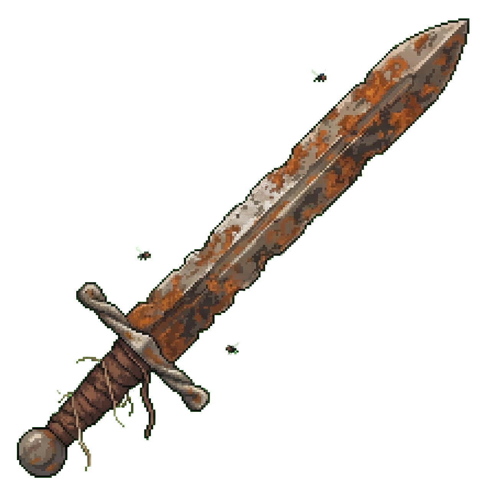
  &nbsp;&nbsp;
  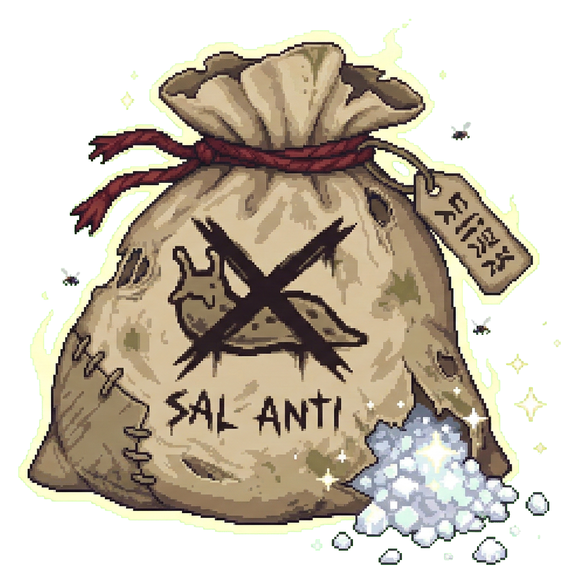
  &nbsp;&nbsp;
  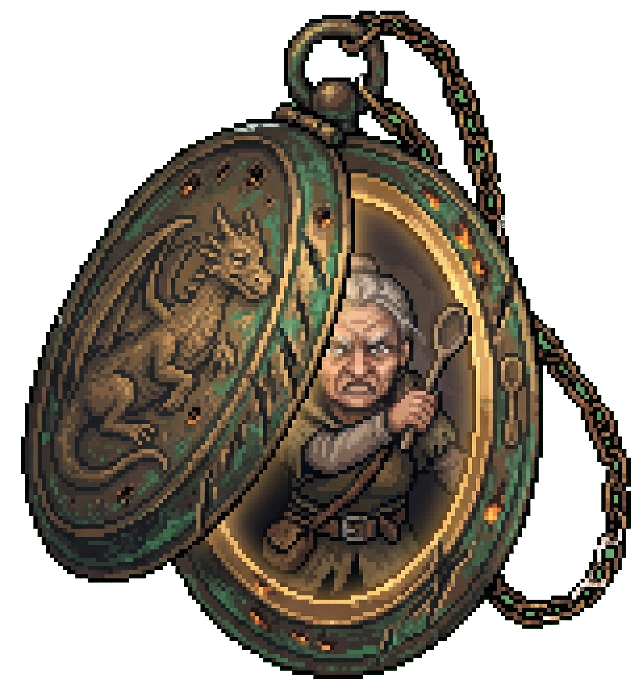
  &nbsp;&nbsp;
  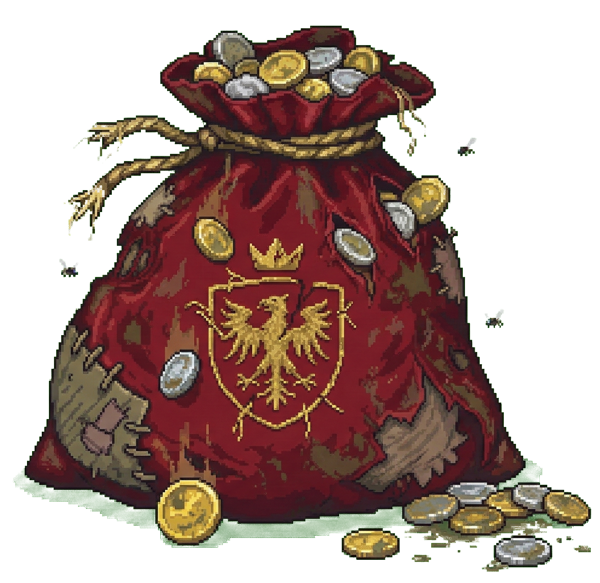
</p>

<p align="center">
  <sub>Rusty Sword (tetanus included) &bull; Anti-Slug Salt (war crime) &bull; Family Locket (emotional damage) &bull; Coin Bag (perpetually empty)</sub>
</p>

---

## Documentation (For the Brave and the Foolish)

Full technical documentation lives in the [`docs/`](docs/) directory. Read it. Or don't. The Narrator doesn't care.

### Core Systems
- [Architecture](docs/arquitectura.md) — How this abomination is held together
- [Game Engine](docs/game-engine.md) — The "brain" of the operation
- [Game Loop](docs/game-loop.md) — The infinite cycle of suffering
- [Game Loader](docs/game-loader.md) — Loads games and judges your design choices
- [Player State](docs/player-state.md) — A detailed record of your failures
- [Store (Zustand)](docs/store.md) — Where your trauma is persisted

### Game Mechanics
- [Data Format](docs/formato-datos.md) — JSON structures (don't get creative, creative = broken)
- [Conditions](docs/condiciones.md) — Logic from hell
- [Effects](docs/efectos.md) — Consequences you deserve
- [Dice System](docs/dados.md) — Let math decide your fate
- [Navigation & Goto](docs/navegacion.md) — Where to go (because you clearly can't decide)
- [RPG Systems](docs/rpg.md) — XP, Skills, Traits (your character's growth, unlike yours)
- [Save/Load](docs/guardado.md) — Immortalize your mistakes
- [Audio](docs/audio.md) — Soundtrack for every trauma

### UI & Presentation
- [Application Phases](docs/fases.md) — Stages of grief, explained
- [Terminal Commands](docs/comandos.md) — For pretending you're a hacker
- [Rich Text Format](docs/rich-text.md) — Making mediocre content look fancy
- [StepResult Reference](docs/step-result.md) — What the engine spits at you
- [File Structure](docs/estructura-archivos.md) — Where everything lives (and dies)
- [Tech Stack](docs/stack.md) — The glue and duct tape
- [Visual Editor](docs/editor.md) — Drag boxes, call it game design

### All 18 Step Types
- [Dialog](docs/pasos/dialog.md) &bull; [Choice](docs/pasos/choice.md) &bull; [Dice](docs/pasos/dice.md) &bull; [Input](docs/pasos/input.md) &bull; [Effects](docs/pasos/effects.md) &bull; [Branch](docs/pasos/branch.md) &bull; [Random](docs/pasos/random.md) &bull; [Check](docs/pasos/check.md)
- [Shop](docs/pasos/shop.md) &bull; [Combat](docs/pasos/combat.md) &bull; [Notify](docs/pasos/notify.md) &bull; [Wait](docs/pasos/wait.md) &bull; [Sound](docs/pasos/sound.md) &bull; [Craft](docs/pasos/craft.md) &bull; [Puzzle](docs/pasos/puzzle.md) &bull; [Examine](docs/pasos/examine.md)
- [Use Item](docs/pasos/use-item.md) &bull; [Timed Choice](docs/pasos/timed-choice.md) &bull; [Level Up](docs/pasos/level-up.md)

### Guides
- [How to Create a Game](docs/guia-crear-juego.md) — (Spoiler: you'll ruin it)

---

## Project Structure

```
Calabosos-y-Baboso/
├── motor_web/                  Web engine (~18,000 lines TS)
│   ├── src/
│   │   ├── engine/             The "brain" (if slugs had brains)
│   │   ├── types/              Type definitions (pretending we're serious)
│   │   ├── hooks/              React hooks (game loop, terminal, boot)
│   │   ├── store/              Zustand stores (your trauma, persisted)
│   │   ├── components/         UI pieces (a.k.a. "chunks of interface")
│   │   ├── editor/             Visual story editor (~5,900 lines)
│   │   ├── styles/             Themes from "dark" to "darker"
│   │   └── utils/              Rich text parser, helpers ("emergency patches")
│   └── public/games/           Available games
│       ├── demo/               Full demo (made by professionals, so it hurts more)
│       └── demo2/              Dungeon demo
├── docs/                       Technical wiki (~40 docs)
├── back/                       Legacy Python terminal (the fossil record)
└── CLAUDE.md                   AI assistant instructions
```

---

## Development

```bash
cd motor_web
npm install          # First time (drag yourself into the dependency abyss)
npm run dev          # Dev server at localhost:5173 (where hopes go to die)
npm run build        # Production build (assuming you get this far)
npm run lint         # ESLint (it will find things to complain about. Always.)
```

### Git Branches

- **main** — Stable release (relatively speaking)
- **cyb-web** — Active development (chaos in progress)

---

## Troubleshooting (a.k.a. "Features")

**"My game crashes at a certain scene"** — It's not a bug, it's a metaphor for how life stops at the worst moments. (Real fix: you probably have a circular condition or invalid reference)

**"Images won't load"** — Have you considered that the engine is protecting players from your "art"? (Real fix: check your paths, they must be relative to the game folder)

**"The narrator insults me too much"** — That's not a bug, that's a feature. He's actually being nice.

**"I can't progress in the game"** — Welcome to real life. (Real fix: use `debug` to check which conditions aren't met)

---

## Authors

<p align="center">
  
</p>

<p align="center">
  Made with love (and slime) by <b>Nicolas & Vanessa</b>
</p>

---

## License

MIT — With the slimy clause: if you use this engine to make a serious or *educational* game, a slug will haunt your dreams for all eternity.

---

> *"You've reached the end of this infinite README. Your reading stats increased by +5. Your dignity, probably not. And remember: it's not just a game, it's a terminal for loading games. The difference is viscous but important. Like many things in life, this project is just an empty shell waiting for you to fill it with content... just like your existence."*

Enjoy the abyss. It'll be waiting.

Forget it, we'll write however we want with an S. The Z is for the guy in the black mask!

— Nicolas & Vanessa
